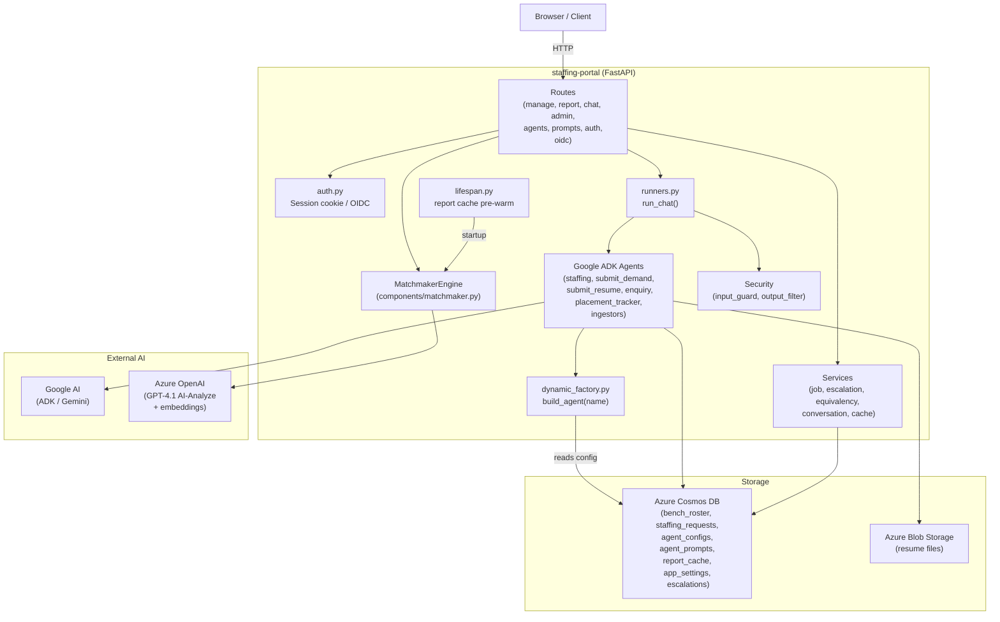

# ARCHITECTURE.md — Staffing Portal Technical Architecture

## System overview

The Staffing Portal is a single FastAPI application that serves all UIs (server-rendered HTML, static dashboard, React SPA) and exposes REST + SSE APIs. It is backed by Azure Cosmos DB (data) and Azure Blob Storage (resume files). AI chat is powered by Google ADK agents running in-process.



---

## Layer descriptions

### Routes (`app/routes/`)
Each file is a FastAPI `APIRouter`. Responsibilities:
- **auth.py** — HTML login page + session management
- **oidc.py** — Azure AD OIDC authorization code flow
- **manage.py** — bench/demand management pages (server-rendered HTML with inline CSS+JS) + REST APIs for CRUD and CSV upload
- **report.py** — match dashboard (serves static HTML), matching API, SSE stream, what-if, AI-analyze, cache management
- **chat.py** — five chat endpoints; delegates to `run_chat()` with the named agent
- **admin.py** — health, metrics, feature flags, escalations, fix-tasks, skill equivalencies
- **agents.py** — agent config CRUD (Agent Builder backend)
- **prompts.py** — prompt content CRUD

### Runners (`app/runners.py`)
`run_chat(agent_name, message, session_id)`:
1. `input_guard.sanitise()` — strip dangerous content, enforce length
2. `build_agent(agent_name)` or cache hit
3. ADK `Runner.run_async()` with `asyncio.wait_for()` timeout
4. `output_filter.mask_pii()` on logged reply
5. Return `ChatResponse`

### Agent registry pattern
`app/agents/dynamic_factory.py` implements `build_agent(name)`:
1. Read agent config from Cosmos `agent_configs` container
2. Load prompt text from `app/config.get_prompt(config.prompt_key)`
3. Look up tools from `TOOL_REGISTRY` in `tool_registry.py`
4. Instantiate `google.adk.agents.LlmAgent` with model, instruction, tools, sub_agents
5. Build and cache `google.adk.Runner` with `InMemorySessionService`

Result: agent configs are **fully runtime-editable** via the Agent Builder UI without redeployment.

### Matching engine
`components/matchmaker.py` (`MatchmakerEngine`):
- Pure Python, deterministic, no I/O in the hot path
- Called by `matching_report_tool.generate_bench_matching_report_structured()`
- Supports optional embedding-based skill equivalence (Azure OpenAI `text-embedding-3-large`)
- Two-tier cache: L1 = in-process `dict`, L2 = Cosmos `report-cache` container

### CSV upload async job pattern
1. HTTP handler reads CSV bytes, creates a `UploadJob` document in Cosmos, spawns `threading.Thread`
2. Background thread processes rows (calling agent tools), updates job progress in Cosmos
3. Client polls `GET /api/upload-jobs/{job_id}` — the manage.py UI uses a progress bar
4. Client can pause/resume/stop via POST endpoints

### React SPA (`app/ui/`)
- React 18 + Vite + TypeScript; built to `app/ui/dist/`
- Served at `/ui` via FastAPI `StaticFiles` mount
- Calls `/api/agents` and `/api/prompts` REST APIs
- Two side-by-side panels: AgentList+AgentEditor, PromptList+PromptEditor
- In dev: run `npm run dev` (port 5173), proxy to backend on port 8000

### Auth flow
```
GET /login              → HTML form
POST /api/auth/login    → check_credentials() → set session cookie → redirect
                                                 (or OIDC redirect if enabled)
GET /oidc/login         → build Azure AD authorize URL + state nonce
GET /oidc/callback      → exchange code for tokens → create local session
```
Session tokens are stored in an in-process `dict` (UUID → expiry). TTL = 8 hours. `require_api_auth` / `require_html_auth` are FastAPI dependencies that read the cookie.

---

## Configuration (`app/config.py`)

`Settings` is a plain class built from `os.environ` at import time. Key groups:

| Group | Env var prefix | Purpose |
|---|---|---|
| Google AI | `GOOGLE_API_KEY` | ADK / Gemini model access |
| Azure Cosmos DB | `COSMOS_*` | All data storage |
| Azure Blob | `AZURE_STORAGE_*` | Resume file storage |
| Azure OpenAI | `AZURE_AI_FOUNDRY_*`, `AZURE_OPENAI_*` | AI-Analyze + embeddings |
| Portal auth | `PORTAL_*` | Username/password login |
| OIDC SSO | `OIDC_*` | Optional Azure AD SSO |
| Skill matching | `SKILL_EMBED_*` | Embedding fallback tuning |
| Runtime | `CHAT_TIMEOUT_SECONDS` | Chat agent timeout |

Runtime feature flags are stored in Cosmos `app_settings` container (doc `runtime_flags`), falling back to `conf/runtime_flags.json`, then `Settings` defaults. Changes propagate to all pods within 60 s (TTL-cached in-process).

---

## Startup sequence

1. `app/config.py` imported → `Settings` built from env vars → startup diagnostic logged
2. `app/main.py` wires all routers and mounts `/ui` if `app/ui/dist/` exists
3. FastAPI `lifespan` context starts → background thread pre-warms report cache
4. Uvicorn begins accepting requests

---

## Data flow: dashboard score request

```
GET /api/report/bench-matches
  → report.py: check L1 in-process cache
  → miss: check L2 Cosmos report-cache container
  → miss: matching_report_tool.generate_bench_matching_report_structured()
      → load all bench candidates from Cosmos bench_roster
      → load all open demands from Cosmos staffing_requests
      → MatchmakerEngine.score_all()
          → for each demand × candidate: skill_utils.enrich_bench_row()
          → equivalency_service.get_equivalencies() (TTL-cached 5 min)
          → optional: Azure OpenAI embedding similarity
      → set L1 + L2 cache
  → return scored demands JSON
```

---

## Adding a new agent (step-by-step)

1. Create `app/agents/<name>/agent.py` with `build_<name>_agent()` function
2. Create `app/agents/<name>/tools/` with tool functions
3. Register tools in `app/agents/tool_registry.py`
4. Add route in `app/routes/chat.py`:
   ```python
   @router.post("/api/<name>/chat", response_model=ChatResponse)
   async def name_chat(req: ChatRequest):
       return await run_chat("<name>", req.message, req.session_id)
   ```
5. Add default agent config to `conf/agents.json`
6. Add prompt file to `conf/prompt/` and update `conf/prompt_files.py`

---

## Docker build

The `Dockerfile` uses a three-stage build:
1. **node** — builds the React SPA (`npm run build`)
2. **python-deps** — `pip install -r requirements.txt` into `/install`
3. **runtime** — copies app source + compiled UI + pip artifacts into a slim Python 3.11 image

`docker-entrypoint.sh` runs `scripts/migrate.py` then `scripts/seed.py` before launching uvicorn. These seed Cosmos with default agent configs and prompts from `conf/`.

Local dev uses `docker compose up` which starts Azurite (Blob emulator) + Cosmos emulator + the app container with hot-reload volume mount.
